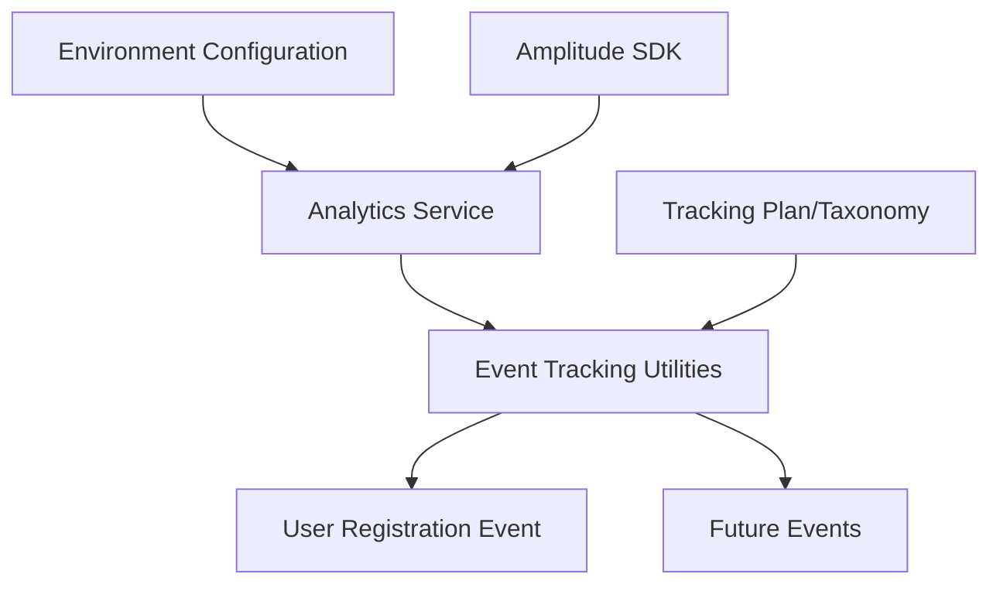

# Amplitude Analytics Integration for Channel AI

## 1. Overview

This document provides a comprehensive plan for integrating Amplitude analytics into the Channel AI project, with a focus on tracking user interactions and establishing a foundation for systematic event tracking.

### 1.1. Objectives

- Implement robust analytics tracking for Channel AI
- Establish a consistent event taxonomy for future tracking
- Begin with user registration events as a foundation
- Enable data-driven decision making for product improvements

### 1.2. Why Frontend Tracking?

We recommend implementing tracking on the frontend for these reasons:
1. Most user interactions happen in the browser
2. Frontend tracking automatically captures client-specific data (device, browser, screen size)
3. Simpler implementation with fewer dependencies
4. Easier to extend for tracking future interactions

## 2. Architecture

### 2.1. Architecture Diagram



### 2.2. Directory Structure

```
src/lib/services/analytics/
├── config.ts      - Configuration and environment variables
├── events.ts      - Event name constants and taxonomy
└── index.ts       - Core analytics functionality
```

### 2.3. Key Components

1. **Configuration Module**: Handles loading API keys and settings from environment variables
2. **Events Module**: Provides constants for event names to ensure consistency
3. **Analytics Service**: Core functionality for initializing Amplitude and tracking events
4. **Auth Integration**: Hooks into the user registration flow to track signup events
5. **Tracking Plan**: Defines a consistent taxonomy of events and properties

## 3. Tracking Plan/Taxonomy

### 3.1. Event Naming Convention

All events should follow a consistent naming pattern:
- Use Title Case with spaces for event names (e.g., "User Registered with Auth0")
- Use the format `object action` (e.g., "User Registered", "Message Sent")
- Use past tense for actions whenever possible

### 3.2. User Events

#### 3.2.1. Authentication Events
- `User Registered with Auth0` - When a new user completes registration using Auth0
- `User Logged In with Auth0` - When a user successfully logs in using Auth0
- `User Logged Out` - When a user logs out

#### 3.2.2. User Properties
- `user_id` - Unique identifier for the user
- `email` - User's email address
- `name` - User's name
- `role` - User's role (admin, regular user, etc.)
- `signup_date` - When the user signed up
- `last_login_date` - When the user last logged in

### 3.3. Chat/Message Events

#### 3.3.1. Conversation Events
- `Conversation Started` - When a new conversation is started
- `Conversation Continued` - When a conversation is continued
- `Conversation Ended` - When a conversation is ended or closed
- `Conversation Exported` - When a conversation is exported
- `Conversation Deleted` - When a conversation is deleted

#### 3.3.2. Message Events
- `Message Sent` - When a user sends a message
- `Message Received` - When a response is received
- `Message Regenerated` - When a response is regenerated
- `Message Rated` - When a user rates a message

### 3.4. Knowledge Management Events

#### 3.4.1. Knowledge Base Events
- `Knowledge Base Created` - When a knowledge base is created
- `Knowledge Base Updated` - When a knowledge base is updated
- `Knowledge Base Deleted` - When a knowledge base is deleted
- `Document Uploaded` - When a document is uploaded to a knowledge base
- `Document Deleted` - When a document is deleted from a knowledge base

### 3.5. Model Events
- `Model Selected` - When a user selects a model
- `Model Configured` - When a user configures model settings

### 3.6. Common Event Properties

The following properties should be included with most events:

- `timestamp` - When the event occurred
- `session_id` - Current session identifier
- `user_id` - User identifier (when available)
- `device_type` - Desktop, mobile, tablet
- `browser` - User's browser
- `platform` - Operating system
- `screen_size` - User's screen dimensions
- `theme` - Current UI theme

## 4. Implementation Steps

### 4.1. Install Amplitude SDK

```bash
npm install @amplitude/analytics-browser
```

### 4.2. Add Environment Variables

Add these lines to `.env`:

```
# Amplitude Analytics
VITE_AMPLITUDE_ENABLED=true
VITE_AMPLITUDE_API_KEY=your_api_key_here
```

### 4.3. Create Analytics Module Files

Create the following directory and files:

```
mkdir -p src/lib/services/analytics
touch src/lib/services/analytics/config.ts
touch src/lib/services/analytics/events.ts
touch src/lib/services/analytics/index.ts
```

### 4.4. Initialize Analytics in Application Layout

Update `src/routes/+layout.svelte` to initialize Amplitude after the user and config are loaded.

### 4.5. Track User Registration

Modify `src/routes/auth/+page.svelte` to track the user registration event.

### 4.6. Test the Implementation

Verify events are being tracked in the Amplitude dashboard.

## 5. Code Samples

### 5.1. Configuration Module (config.ts)

```typescript
export interface AnalyticsConfig {
  enabled: boolean;
  amplitudeApiKey: string;
  debugMode: boolean;
}

// Default configuration that can be overridden
export const defaultConfig: AnalyticsConfig = {
  enabled: false,
  amplitudeApiKey: '',
  debugMode: false
};

// Load configuration from environment variables
export function loadConfig(): AnalyticsConfig {
  return {
    enabled: import.meta.env.VITE_AMPLITUDE_ENABLED === 'true',
    amplitudeApiKey: import.meta.env.VITE_AMPLITUDE_API_KEY || '',
    debugMode: import.meta.env.DEV === true
  };
}
```

### 5.2. Event Constants (events.ts)

```typescript
/**
 * Constants for event names to ensure consistency
 */
export const EVENTS = {
  // User authentication events
  USER_REGISTERED_WITH_AUTH0: 'User Registered with Auth0',
  USER_LOGGED_IN_WITH_AUTH0: 'User Logged In with Auth0',
  USER_LOGGED_OUT: 'User Logged Out',
  
  // Conversation events
  CONVERSATION_STARTED: 'Conversation Started',
  CONVERSATION_CONTINUED: 'Conversation Continued',
  CONVERSATION_ENDED: 'Conversation Ended',
  CONVERSATION_EXPORTED: 'Conversation Exported',
  CONVERSATION_DELETED: 'Conversation Deleted',
  
  // Message events
  MESSAGE_SENT: 'Message Sent',
  MESSAGE_RECEIVED: 'Message Received',
  MESSAGE_REGENERATED: 'Message Regenerated',
  MESSAGE_RATED: 'Message Rated',
  
  // Knowledge base events
  KNOWLEDGE_BASE_CREATED: 'Knowledge Base Created',
  KNOWLEDGE_BASE_UPDATED: 'Knowledge Base Updated',
  KNOWLEDGE_BASE_DELETED: 'Knowledge Base Deleted',
  DOCUMENT_UPLOADED: 'Document Uploaded',
  DOCUMENT_DELETED: 'Document Deleted',
  
  // Model events
  MODEL_SELECTED: 'Model Selected',
  MODEL_CONFIGURED: 'Model Configured'
}
```

### 5.3. Analytics Service (index.ts)

```typescript
import { amplitude } from '@amplitude/analytics-browser';
import { loadConfig, type AnalyticsConfig } from './config';

// Store initialized state
let initialized = false;

/**
 * Initialize the analytics service
 */
export function initializeAnalytics() {
  if (initialized) {
    return true;
  }

  const config = loadConfig();

  if (!config.enabled || !config.amplitudeApiKey) {
    if (config.debugMode) {
      console.warn('Analytics is disabled or missing API key');
    }
    return false;
  }

  try {
    amplitude.init(config.amplitudeApiKey, {
      logLevel: config.debugMode ? 2 : 0
    });

    initialized = true;
    
    if (config.debugMode) {
      console.log('Analytics initialized successfully');
    }
    
    return true;
  } catch (error) {
    console.error('Failed to initialize analytics:', error);
    return false;
  }
}

/**
 * Track an event
 * @param eventName Name of the event
 * @param eventProperties Additional properties for the event
 */
export function trackEvent(eventName: string, eventProperties: Record<string, any> = {}) {
  if (!initialized) {
    // Try to initialize if not already
    if (!initializeAnalytics()) {
      return;
    }
  }

  try {
    amplitude.track(eventName, eventProperties);
  } catch (error) {
    console.error(`Error tracking event ${eventName}:`, error);
  }
}

/**
 * Set user properties
 * @param userId User ID
 * @param userProperties User properties to set
 */
export function setUserProperties(userId: string, userProperties: Record<string, any> = {}) {
  if (!initialized) {
    // Try to initialize if not already
    if (!initializeAnalytics()) {
      return;
    }
  }

  try {
    amplitude.setUserId(userId);
    amplitude.identify({
      userProperties
    });
  } catch (error) {
    console.error('Error setting user properties:', error);
  }
}

/**
 * Reset user ID and clear user properties (for logout)
 */
export function resetUser() {
  if (!initialized) {
    return;
  }

  try {
    amplitude.setUserId(null); // Clear the user ID
    amplitude.reset(); // Reset user properties
  } catch (error) {
    console.error('Error resetting user:', error);
  }
}
```

## 6. Integration with Existing Code

### 6.1. Layout Component Integration

Update `src/routes/+layout.svelte`:

```svelte
<script>
  import { onMount } from 'svelte';
  import { initializeAnalytics } from '$lib/services/analytics';
  
  // Existing imports...
  
  onMount(() => {
    // Initialize analytics
    initializeAnalytics();
    
    // Other existing initialization code...
  });
</script>
```

### 6.2. User Registration Integration

Update `src/routes/auth/+page.svelte`:

```svelte
<script>
  // Add imports
  import { trackEvent, setUserProperties } from '$lib/services/analytics';
  import { EVENTS } from '$lib/services/analytics/events';

  // Then modify setSessionUser function
  const setSessionUser = async (sessionUser) => {
    if (sessionUser) {
      console.log(sessionUser);
      toast.success($i18n.t(`You're now logged in.`));
      if (sessionUser.token) {
        localStorage.token = sessionUser.token;
      }

      $socket.emit('user-join', { auth: { token: sessionUser.token } });
      await user.set(sessionUser);
      await config.set(await getBackendConfig());

      // Track user login or signup
      if (mode === 'signup') {
        // Track signup event
        trackEvent(EVENTS.USER_REGISTERED_WITH_AUTH0, {
          user_id: sessionUser.id,
          role: sessionUser.role
        });
        
        // Set user properties
        setUserProperties(sessionUser.id, {
          email: sessionUser.email,
          name: sessionUser.name,
          role: sessionUser.role,
          signup_date: new Date().toISOString()
        });
      } else {
        // Track login event
        trackEvent(EVENTS.USER_LOGGED_IN_WITH_AUTH0, {
          user_id: sessionUser.id
        });
      }

      const redirectPath = querystringValue('redirect') || '/';
      goto(redirectPath);
    }
  };
</script>
```

## 7. Testing

### 7.1. Testing Plan

1. Set up a test environment with the Amplitude API key
2. Register a new user and verify the registration event is tracked
3. Login with an existing user and verify the login event is tracked
4. Test logout functionality and verify the logout event is tracked
5. Test the implementation across different browsers and devices

### 7.2. Validating Events

1. Use the Amplitude Live View to see events as they happen
2. Verify that user properties are set correctly
3. Check that event properties match the expected format

## 8. Future Extensions

The analytics service has been designed to make it easy to add tracking for additional events in the future:

### 8.1. Phase 2 Implementation

1. Implement conversation and message tracking
2. Add knowledge base event tracking
3. Implement model selection tracking

### 8.2. Phase 3 Implementation

1. Implement funnel analysis for key user flows
2. Create custom dashboards for key metrics

### 8.3. Technical Extensions

1. Add automatic error tracking
2. Implement session tracking with timeouts
3. Add tracking for feature usage and performance metrics

# Amplitude Analytics Integration

## 1. Overview

This document outlines the integration of Amplitude Analytics into our application to track user behavior and interactions. Amplitude provides insights into how users engage with our application, enabling data-driven decisions to improve the user experience.

## 2. Prerequisites

- Amplitude account with API key
- Access to Amplitude Data for tracking plan management

## 3. Event Taxonomy

We use the following naming convention for events:
- Title Case with spaces (e.g., "User Registered with Auth0")
- Object-action format (e.g., "User Logged In")
- Past tense for actions

### 3.1 Authentication Events

| Event Name | Description | Properties |
|------------|-------------|------------|
| User Registered with Auth0 | User registered to the application using Auth0 | user_id, timestamp, session_id |
| User Logged In with Auth0 | User logged in to the application using Auth0 | user_id, timestamp, session_id |
| User Logged Out | User logged out of the application | user_id, timestamp, session_id |

### 3.2 User Properties

| Property Name | Description |
|---------------|-------------|
| user_id | Unique identifier for a user |
| email | User's email address |
| name | User's full name |
| role | User's role in the system |
| Signup Time | When the user first signed up |
| Last Login Time | When the user last logged in |

### 3.3 Common Event Properties

The following properties should be included with most events:

| Property Name | Description |
|---------------|-------------|
| timestamp | When the event occurred |
| session_id | Unique identifier for the user's session |
| user_id | Unique identifier for the user |
| device_type | The type of device used |
| browser | The browser used |
| platform | The operating system used |
| screen_size | The screen size used |
| theme | The UI theme used |

## 4. Implementation with Ampli SDK

We're using Amplitude's Ampli SDK, which provides type-safe analytics implementation based on a tracking plan defined in Amplitude Data.

### 4.1 Setting Up Ampli

```bash
# Install the Ampli CLI tool
npm install -g @amplitude/ampli

# Install the required dependency
npm install @amplitude/analytics-browser
```

### 4.2 Initialize Ampli in the Application

The Ampli SDK has been integrated into our codebase and is initialized during application startup. The main integration file is located at `/src/lib/services/analytics/index.ts`.

Here's how Ampli is initialized:

```typescript
// In src/lib/services/analytics/index.ts
import { ampli } from '../../../ampli';

export function initializeAnalytics(): boolean {
  try {
    ampli.load({
      environment: 'nexus',
      client: {
        configuration: {
          logLevel: import.meta.env.DEV ? 100 : 0
        }
      }
    });
    
    console.log('Amplitude Analytics initialized successfully');
    return true;
  } catch (error) {
    console.error('Failed to initialize Amplitude Analytics:', error);
    return false;
  }
}
```

### 4.3 Tracking Events

The Ampli SDK provides type-safe event tracking methods based on the tracking plan. Here's how events are tracked:

```typescript
// Track user registration
export function trackUserRegisteredWithAuth0(userId: string): void {
  ampli.identify(userId, {
    "Signup Time": new Date().toISOString()
  });
  ampli.track(new ampli.UserRegisteredWithAuth0());
}

// Track user login
export function trackUserLoggedInWithAuth0(userId: string): void {
  ampli.identify(userId, {
    "Last Login Time": new Date().toISOString()
  });
  ampli.track(new ampli.UserLoggedInWithAuth0());
}

// Track user logout
export function trackUserLoggedOut(): void {
  ampli.track(new ampli.UserLoggedOut());
}
```

### 4.4 Updating the Tracking Plan

When changes are needed to the tracking plan:

1. Update the tracking plan in Amplitude Data
2. Run `npx ampli pull` to update the generated SDK
3. Update the implementation to use any new events or properties

## 5. Environment Variables

The following environment variables are needed for Amplitude:

```
VITE_AMPLITUDE_ENABLED=true
VITE_AMPLITUDE_API_KEY=your_api_key_here
```

## 6. Next Steps

- Implement tracking for additional user interactions
- Set up dashboards in Amplitude to visualize the data
- Configure alerts for important metrics
- Add more detailed properties to events for deeper analysis

## 7. Resources

- [Amplitude Documentation](https://www.docs.amplitude.com/)
- [Ampli SDK Documentation](https://www.docs.developers.amplitude.com/data/sdks/typescript-browser/ampli/)
- [Tracking Plan Best Practices](https://help.amplitude.com/hc/en-us/articles/360047138352-Tracking-Plans)